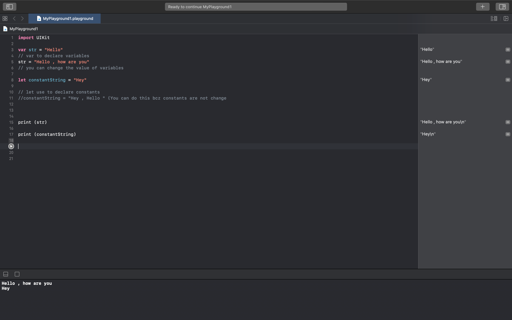

# String Variables in Swift 

## Swift program

import UIKit

var str = "Hello"
// var to declare variables
str = "Hello , how are you"
// you can change the value of variables

let constantString = "Hey"

// let use to declare constants
//constantString = "Hey , Hello " (You can do this bcz constants are not change

print (str)

print (constantString)

Feel free to Star or Fork it and make your changes , then make pull request.

We will appreciate your Changes and Review it 😄

	 
	 
	 
	 
	
	
Loading

	 
	 
	 
	 

